## OpenCode4Connections

    This project is an OpenCode4Connections project and is available under the Apache License V2.0.  
    All other aspects of the project, including contributions, defect reports, discussions, feature
    requests and reviews are subject to the OpenNTF Terms of Use - available at: 
         http://openntf.org/Internal/home.nsf/dx/Terms_of_Use.

------

# **Guest Model Customizer extension**
This set of scripts addresses 3 areas:
1. Custom Guest Model
2. Privacy
3. Sametime Cloud AutoLogin 

------
# *Custom Guest Model*
The goal of this area is to provide a mean by which "external guest" sharing and invitations is hidden to a selected category of users. The following features are available:
- The "Invite Guest" menu item is hidden to the users not having the rights to invite external people 
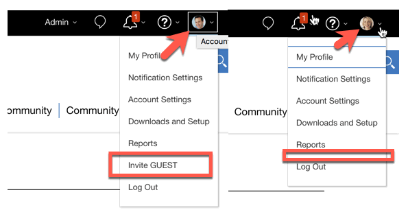

- Users not having the rights to invite external people cannot create a Restricted Community open to External users
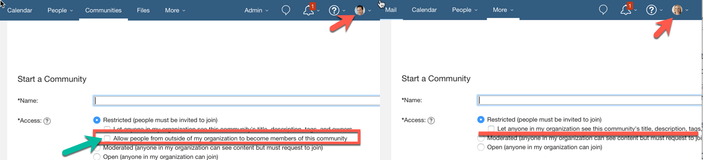
    1. **Note:** 
for the users having the rights, the default is also changed as shown by the green arrow

- Users not having the rights to invite external people cannot upload a file which becomes open to external people nor create a folder which is accessible to external people 
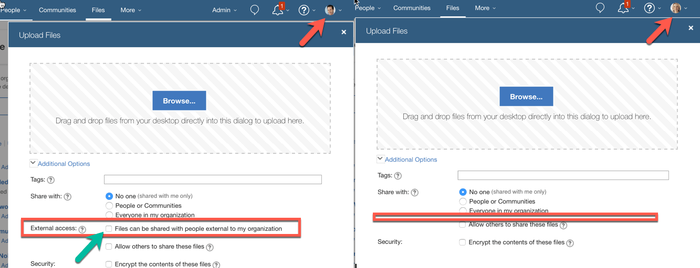
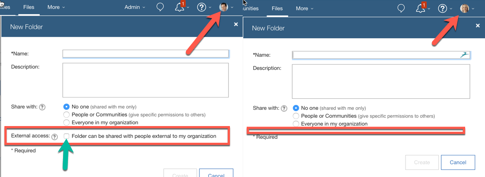
    1. **Note:** 
for the users having the rights, the default is also changed as shown by the green arrow
    2. **Note:** 
The same applies when the user creates a "New Document", "New Spreadsheet" and "New Presentation"

- Users not having the rights to invite external people cannot create an Activity which becomes open to external people 
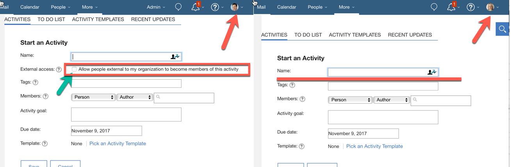
    1. **Note:** 
for the users having the rights, the default is also changed as shown by the green arrow

- Users not having the rights to invite external people cannot add or invite an external person to a Restrcited Community for which they are owners 
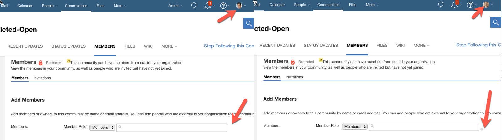

    1. **Note** : 
as shown in the above picture, **the rights** to invite external people into an existing Restricted Community and the rights to create a Restricted Community open to external people **can be different** (this means that someone may not be able to create a Restricted Community open to external people but if she is the owner of an existing Restricted Community she may be able to invite external people into it) 
    2. **Note** :
if the user created a CONTACT for a person that is not yet a registered user or guest in Connections Cloud, referencing that Contact in the Add/Invite Member section actually displays the contact in the dropdown list. By hitting the "Save" button, the user could actually add the Contact to the Community even if the "+" sign is disabled. In order to address this situation, the script intercepts the resulting invitation form and proposes to follow a LINK which points to a custom page where the request for inviting the person should be dealt with by authorized people. See the follwoing picture:
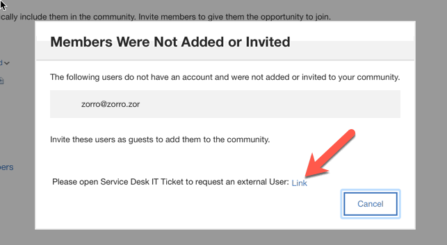

### *Installation*
You can install these extensions directly by adding the [GuestModel_common.json](./GuestModel_common.json) JSON file into the Organization Extensions of your IBM Connections Cloud organization.

### *Customization*
You may want to customize the "Access Control Lists" which define the rights previously described. In order to do this, you need to modify the following lines at the bottom of the [GuestModel_Common.js](./GuestModel_common.js) file:
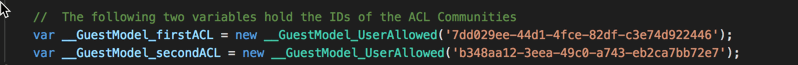

- Simply change the UUID of the two communities referenced by the global variables shown in the picture above to point to two Communities you have previously created in your organization.
- you need to create two communities (I suggest you create **RESTRICTED Communities** as the script is able to properly manage the 403 errors from APIs) and add, as members for those Communities, the people you want to have the rights
    1. __GuestModel_firstACL represents the ACL allowing people to invite external users and to share content with external users
    2. __GuestModel_secondACL represents the ACL allowing people to add/invite members to an already created Restricted Community.

You may also want to customize the Link to the "service desk" page which manages invitations for external people who are referenced in the personal Contacts. In that case you need to modify the following value in the [GuestModel_Common.js](./GuestModel_common.js) file:
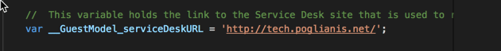

### *Technical impact*
The scripts creates a Cookie with this name:

    Customizer-<userId>-<communityId>

The "communityId" refers the Community Uuid of the relevant ACL Community.
The Cookie can hold a value of **true** or **false** .

The Cookie is used to store the authorization status for the two ACLs previously described. Since getting the authorization status requires a REST call to the IBM Connections APIs (to validate the membership of the current user against the two Communities modelling the ACLs), saving the status in a Cookie avoids unnecessary calls and speeds up the execution of the scripts. 

The **side effect** is that if the ACL memembership is changed when the user has a browser open, the user will need to close the browser in order to have the new authorization status reflected in the behavior of the scripts.

------
# *Privacy*

The goal of this area is to provide a mean by which an organization could selectively hide the details of whom viewed/downloaded any given file. 
The idea is that sometimes, to comply with local policies, organizations need to protect the details of certain actions performed by the user and which did not require an explicit **consent**. Viewing or Downloading a file is one of these activities. 

The script automatically removes from the "View" widget in the "About" tab of the Files Preview page the details of people whose identity needs to be protected.

In the following picture, both Franck Adams and Heather Reeds viewed the document but their details are not shown:
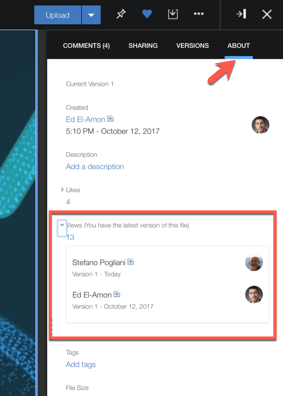
 
### *Installation*
You can install these extensions directly by adding the [HideUserActivity.json](./HideUserActivity.json) JSON file into the Organization Extensions of your IBM Connections Cloud organization.

### *Customization*
You may want to customize the criteria used by the script to select the people to hide, you need to modify the following function in the [HideUserActivity.js](./HideUserActivity.js) script:
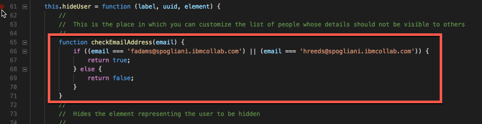
In the example, we want to hide the View/Download actions performed by *fadams@spogliani.ibmcollab.com* and *hreeds@spogliani.ibmcollab.com*. 
You may want to use a more sophisticated algorithm, involving the use of regular expressions for instance.

### *Technical impact*
The scripts does not have any technical impact on the behavior of your browser session.

------
# *Sametime Cloud AutoLogin* 

The goal of this area is to provide a mean by which an organization replace the default behavior of the IBM Connections Cloud embedded Sametime Autologin.
By default, today, when a user logs into IBM Connections Cloud, and automatic Login is performed on the emebedded Sametime.

This may not be adapted to organizations where many users still use the IBM Notes client to access their email and have the IBM Sametime application embedded in the IBM Notes client.

The way in which the script works is the following:

    When the user logs the first time, the AutoLogin feature is removed
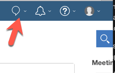

    The user could force AutoLogin by setting the relevant checkbox:
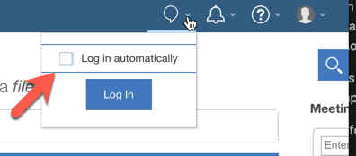
    
    At this point, AutoLogin will be re-enabled.

    The user can prevent AutoLogin again by unchecking the relevant checkbox

 
### *Installation*
You can install these extensions directly by adding the [SametimeNoAuto.json](./SametimeNoAuto.json) JSON file into the Organization Extensions of your IBM Connections Cloud organization.

### *Customization*
No customization options for this script

### *Technical impact*
The scripts creates a Cookie with this name:

    CustomizerSametimeCookie

When this Cookie is present, the AutoLogin behavior is determined by the user having checked/unchecked the relevant UI option.

The scripts also manages a standard IBM Sametime Cookie

    stproxy.dock.notremembered

This cookie is set to "no-auto-connect" when the new default behavior of preventing Auto-Login is in place.

I do not manage "persistent cookies". You may need to modify the source code to manage them:
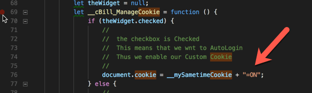
